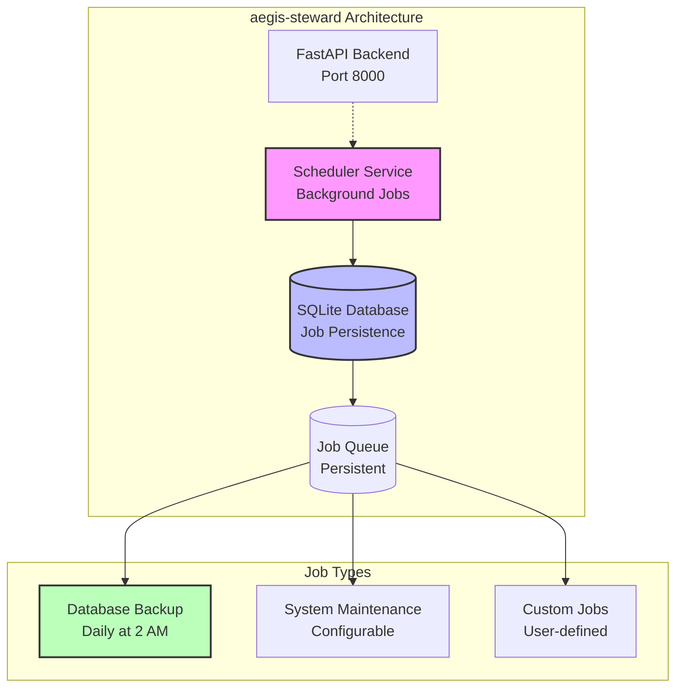

# Scheduler Component

The Scheduler Component provides background task processing and cron job capabilities using [APScheduler](https://apscheduler.readthedocs.io/).

## Overview

aegis-steward includes a scheduler component that runs as an independent service, enabling:

- **Background job processing**
- **Cron-style scheduled tasks**
- **Async job execution**
- **Job persistence and recovery**
- **Real-time job monitoring**
- **Task statistics tracking**
## Architecture


## Running the Scheduler

The scheduler runs as a Docker service. Use these commands:

### Docker Deployment
```bash
# Run only scheduler service
docker compose --profile dev up scheduler

# Run all services including scheduler
make run

# Or use docker compose directly
docker compose --profile dev up
```

## Database Persistence Features

Your scheduler includes persistence capabilities through SQLAlchemy jobstore:

### Persistence Features
- **Job Persistence**: Jobs survive container restarts via SQLAlchemy jobstore
- **Daily Database Backup**: Pre-configured backup job at 2 AM UTC
- **Real-Time Task Monitoring**: Track task statistics (total, active, paused)
- **Upcoming Task Lists**: View scheduled jobs with next execution times
- **Job History**: Query past executions and failures

### Task Monitoring

#### CLI Health Check
```bash
aegis-steward health check --detailed

# Example Output:
✓ scheduler         Scheduler running with 3 tasks
  └─ Tasks: 3 total, 3 active, 0 paused
     └─ Upcoming Tasks (Next 3):
        ├─ database_backup: Daily at 2:00 AM UTC → in 5h
        ├─ cleanup_temp: Every 6 hours → in 2h
        └─ report_gen: Weekly on Monday → in 3d
```

#### Dashboard UI Card
The scheduler component card provides:

- **Task counter** with status-aware coloring (healthy/warning states)
- **Scrollable upcoming jobs** with next execution countdowns
- **Interactive controls** (pause/delete buttons appear on hover)
- **Job details** showing schedule patterns and names

## Job Configuration

Each service lists its own scheduled jobs, as `JOBS` in
`app/services/<service>/scheduled_jobs.py`. The scheduler (`main.py`)
schedules every service's entries (`app.core.schedule.service_jobs`); the
heartbeat is the only job it registers on its own. A service you write, or a
plugin, adds jobs with no edit outside its own package.

```python
# app/services/system/scheduled_jobs.py
from app.core.schedule import LONG_RUNNING, ServiceJob
from app.services.system.backup import backup_database_job

JOBS: tuple[ServiceJob, ...] = (
    ServiceJob(
        backup_database_job,
        "database_backup",
        "Daily Database Backup",
        {"trigger": "cron", "hour": 2, "minute": 0},
        timeout=LONG_RUNNING,
    ),
)
```

Each entry is a job function, a stable id, a display name, the trigger as
`add_job` keyword arguments, and an optional `timeout` (below). Every entry
gets `max_instances=1`, `coalesce=True` and `replace_existing=True`. Two
entries may not share an id or a function name: the scheduler keys on the
id and the worker on the name, so startup fails rather than letting one
replace the other.

### Where jobs run

This project has a worker, so the scheduler only produces. Each entry is
scheduled as an enqueue of the job's function name onto the `system` queue,
and the worker registers the same entry as a task under that name and runs
it, with the worker's resources, retries and live feed. The heartbeat stays
in the scheduler, because it proves the scheduler's own loop is alive.

- **Timeouts.** A job runs under the system queue's limit (five minutes)
  unless its entry sets `timeout`; the long jobs set `LONG_RUNNING`.
- **Run Now** (the dashboard button, `POST /api/v1/scheduler/jobs/{id}/run`,
  or `tasks trigger`) repeats the stored call, so a manual run is an enqueue
  too and lands on the worker, never in the webserver.
- **Run history.** The Scheduler page records the enqueue, which takes
  milliseconds; the job's own run time and outcome are on the Worker page.
- **Redis down.** A job that cannot be enqueued is recorded as a failed run.

### Pre-configured Jobs

With the database component, the system service schedules a daily backup
at 2:00 UTC that writes a timestamped backup, rotates old files and never
overlaps itself. Other services bring their own entries (the AI catalog
sync, the finance snapshot jobs, and so on) when they are installed, and
take them away when they are removed.

## Adding Custom Jobs

### 1. Create Job Function

Create the job with the service it belongs to, as an `async def` that takes
no arguments:

```python
# app/services/reports/jobs.py
from app.core.log import logger


async def process_daily_reports() -> None:
    """Generate daily reports."""
    logger.info("Starting daily report generation")
    # Your job logic here
```

### 2. List It in the Service's `scheduled_jobs.py`

```python
# app/services/reports/scheduled_jobs.py
from app.core.schedule import ServiceJob
from app.services.reports.jobs import process_daily_reports

JOBS: tuple[ServiceJob, ...] = (
    ServiceJob(
        process_daily_reports,
        "daily_reports",
        "Daily Report Generation",
        {"trigger": "cron", "hour": 6, "minute": 0},
    ),
)
```

Code is the source of truth: every startup re-registers each entry via
`replace_existing=True`, so editing a trigger and redeploying is all it
takes to change a schedule.

## Job Scheduling Options

### Cron-Style Triggers

Put `trigger="cron"` plus the cron fields in the entry's trigger:

```python
# Every day at 2:30 AM
trigger="cron", hour=2, minute=30

# Every Monday at 9:00 AM
trigger="cron", day_of_week="mon", hour=9, minute=0

# Every 15 minutes
trigger="cron", minute="*/15"

# First day of every month at midnight
trigger="cron", day=1, hour=0, minute=0
```

### Interval Triggers

Put `trigger="interval"` plus the interval span in the entry's trigger:

```python
# Every 5 minutes
trigger="interval", minutes=5

# Every 2 hours
trigger="interval", hours=2

# Every 30 seconds
trigger="interval", seconds=30
```

### One-Time Jobs
```python
from datetime import datetime, timedelta

# Run once in 1 hour
scheduler.add_job(
    one_time_task,
    trigger="date",
    run_date=datetime.now() + timedelta(hours=1),
    id="one_time_task"
)
```

## Job Management

### Listing Jobs
```python
# Get all scheduled jobs
jobs = scheduler.get_jobs()
for job in jobs:
    print(f"Job: {job.name}, Next run: {job.next_run_time}")
```

### Modifying Jobs
```python
# Pause a job
scheduler.pause_job("daily_reports")

# Resume a job
scheduler.resume_job("daily_reports")

# Remove a job
scheduler.remove_job("old_job_id")

# Modify job schedule
scheduler.modify_job("daily_reports", hour=7)  # Change to 7 AM
```

### Production Job Updates

To change a schedule in production, edit the entry's trigger in its
service's ``scheduled_jobs.py`` and redeploy. Every entry is
scheduled with ``replace_existing=True``, so the new trigger overwrites
the persisted row on the next scheduler restart.

Runtime edits via ``scheduler.modify_job()`` are intentionally not
preserved across restarts — code wins, so deploys never silently
drift from the committed configuration.

## Error Handling

### Job Error Handling
```python
async def robust_job():
    """A job with proper error handling."""
    try:
        logger.info("Starting robust job")

        # Job logic here
        result = await some_async_operation()

        logger.info(f"Job completed successfully: {result}")

    except Exception as e:
        logger.error(f"Job failed: {str(e)}", exc_info=True)
        # Optionally send alerts or retry logic
```

### Scheduler Error Listeners
```python
def job_listener(event):
    """Listen for job events."""
    if event.exception:
        logger.error(f"Job {event.job_id} crashed: {event.exception}")
    else:
        logger.info(f"Job {event.job_id} executed successfully")

# Add listener to scheduler
scheduler.add_listener(job_listener, EVENT_JOB_EXECUTED | EVENT_JOB_ERROR)
```

## Monitoring Jobs

### Health Checks
The scheduler health is included in system health checks:

```bash
aegis-steward health check --detailed
```

Shows scheduler status, task statistics, active jobs, and next execution times.
### Job Logging
All job executions are logged with structured logging:

```json
{
  "timestamp": "2024-01-01T02:00:00Z",
  "level": "INFO",
  "logger": "scheduler",
  "message": "Job executed successfully",
  "job_id": "system_maintenance",
  "execution_time_ms": 1250
}
```

### Custom Job Metrics
Add metrics to your jobs:

```python
import time
from app.core.log import logger

async def monitored_job():
    start_time = time.time()

    try:
        # Job work here
        await do_work()

        execution_time = time.time() - start_time
        logger.info(f"Job completed in {execution_time:.2f}s")

    except Exception as e:
        execution_time = time.time() - start_time
        logger.error(f"Job failed after {execution_time:.2f}s: {e}")
        raise
```

## Configuration

### Scheduler Settings
Configure scheduler behavior in `app/core/config.py`:

```python
class Settings(BaseSettings):
    # Scheduler configuration
    scheduler_timezone: str = "UTC"
    scheduler_max_workers: int = 10
    scheduler_job_defaults: dict = {
        "coalesce": False,
        "max_instances": 3
    }
```

### Persistence Configuration
The scheduler automatically uses SQLAlchemy jobstore with your database:

```python
# Configured in create_scheduler()
from apscheduler.jobstores.sqlalchemy import SQLAlchemyJobStore
from app.core.db import engine

jobstore = SQLAlchemyJobStore(engine=engine, tablename='apscheduler_jobs')
scheduler = AsyncIOScheduler(jobstores={'default': jobstore})
```

Jobs are stored in the `apscheduler_jobs` table with automatic schema creation.
## Best Practices

### 1. Keep Jobs Small and Focused
```python
# Good: Small, focused job
async def send_daily_summary():
    await generate_summary()
    await send_email()

# Better: Break into smaller jobs
async def generate_daily_summary():
    return await generate_summary()

async def send_summary_email():
    summary = await get_cached_summary()
    await send_email(summary)
```

### 2. Use Proper Async Patterns
```python
# Good: Use async/await consistently
async def async_job():
    async with httpx.AsyncClient() as client:
        response = await client.get("https://api.example.com")
        return response.json()

# Avoid: Blocking operations
def bad_job():
    response = requests.get("https://api.example.com")  # Blocks event loop
    return response.json()
```

### 3. Handle Job Dependencies
```python
async def dependent_job():
    # Check if prerequisite job completed
    if not await check_prerequisite_completed():
        logger.warning("Prerequisite not completed, skipping job")
        return

    await perform_dependent_work()
```

### 4. Use Idempotent Jobs
```python
async def idempotent_job():
    # Check if work already done today
    if await is_work_already_done_today():
        logger.info("Work already completed today")
        return

    await perform_work()
    await mark_work_completed()
```

## Troubleshooting

### Common Issues

**Jobs not executing:**
- Check if scheduler service is running
- Verify job is properly registered
- Check timezone settings
- Review job logs for errors

**Database connection issues:**
- Verify database service is running
- Check SQLite file permissions
- Review database initialization logs
- Confirm jobstore table creation

**Jobs not persisting:**
- Verify database write permissions
- Review SQLAlchemy jobstore logs
**High memory usage:**
- Monitor job execution times
- Check for memory leaks in job functions
- Consider job queue limits

**Jobs running too frequently:**
- Review cron trigger configuration
- Check for overlapping job instances
- Consider using `max_instances=1` for singleton jobs

### Debug Commands
```bash
# Check scheduler status
aegis-steward health check

# View scheduler logs
docker compose logs scheduler

# Check database for jobs
sqlite3 app.db "SELECT id, name, next_run_time FROM apscheduler_jobs;"

# List all jobs (in Python shell)
python -c "
from app.components.scheduler.main import create_scheduler
scheduler = create_scheduler()
for job in scheduler.get_jobs():
    print(f'{job.id}: {job.next_run_time}')
"
```

## Production Considerations

1. **Database Backups**: Your automatic backup job handles database persistence
2. **Job Monitoring**: Use the built-in task statistics for monitoring
3. **Resource Limits**: Configure appropriate memory and CPU limits
4. **Timezone Handling**: All jobs use UTC (configured automatically)
5. **Error Notifications**: Implement alerting for critical job failures
6. **Job Updates**: Edit triggers in the service's ``scheduled_jobs.py`` and redeploy; code is the source of truth
